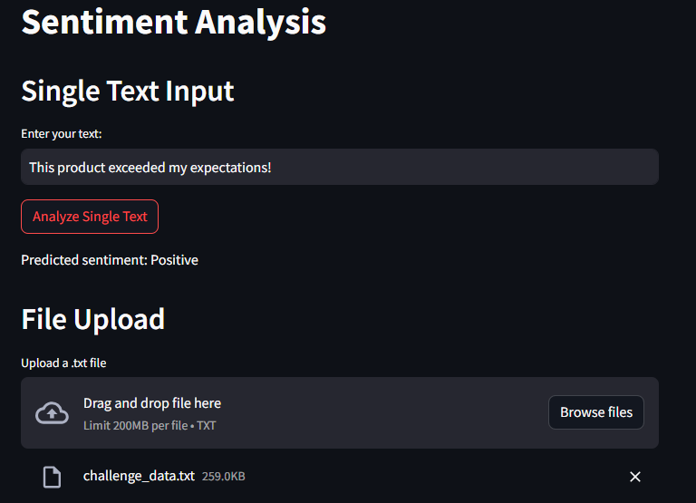
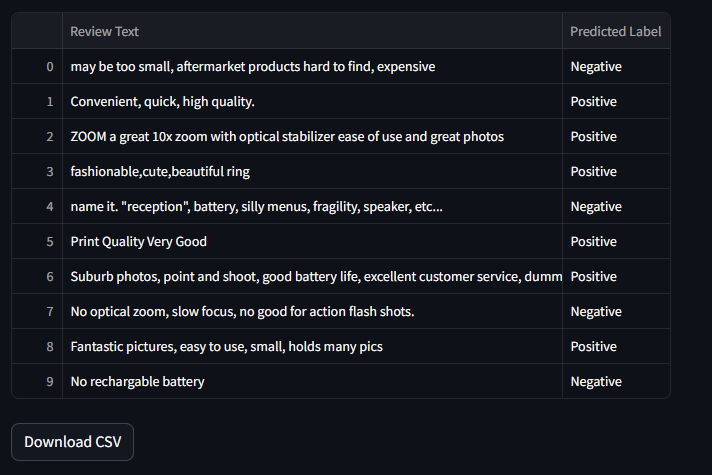

# Sentiment-Analysis-for-Product-Reviews

This mini project implements binary text classification techniques to perform sentiment analysis on product reviews. Given a corpus of positive and negative reviews, the goal is to build a classifier to predict the sentiment (positive or negative) of a given review.

### Directories:

The project directory contains code and data for sentiment analysis. Below is the structure of directories and files:

#### Datasets/

- **negative-reviews.txt**: Contains 20,000 lines of reviews (one review per line) considered to be negative reviews.
- **positive-reviews.txt**: Contains 20,000 lines of reviews (one review per line) considered to be positive reviews.
- **positive-words**: Contain 2,006 positive words used for sentiment analysis.
- **negative-words**: Contain 4,783 negative words used for sentiment analysis.
- **challenge_data.txt**: Containing 5,868 reviews (one review per line). Use for testing best text classification model to predict if each review is either positive or negative.

#### Models/

- **best_model.pkl**: A saved machine learning model (possibly for sentiment analysis) in the pickle format.
- **scaler.pkl**: A saved scaler object (possibly used for scaling features) in the pickle format.
- **tfidf_vectorizer**: A saved TF-IDF vectorizer object (possibly used for text vectorization) in an appropriate format.

### Files:

- **app.py**: This is the main Python file containing the Streamlit application for sentiment analysis.
- **Sentiment_Classification_Analysis.ipynb**: This is a Jupyter Notebook file that contains code for sentiment analysis, including data preprocessing, feature extraction, model training, and evaluation.

## Installation Requirements

To run the code in this project, you will need the following libraries:

- pandas
- matplotlib
- seaborn
- wordcloud
- scikit-learn
- numpy
- spaCy
- nltk
- textblob 
- nrclex
- constractions
- streamlit 
- scipy
- joblib

Additionally, if you're using spaCy, you'll need to download the English language model:
- python -m spacy download en_core_web_sm

🚀 **Test the Streamlit app [here](https://sentiment-analysis-for-appuct-reviews-9ysxxd4btrqvzvx5zuv8ya.streamlit.app/)** 🌟
or run command 
- streamlit run app.py

 

&nbsp;&nbsp;&nbsp;&nbsp;
